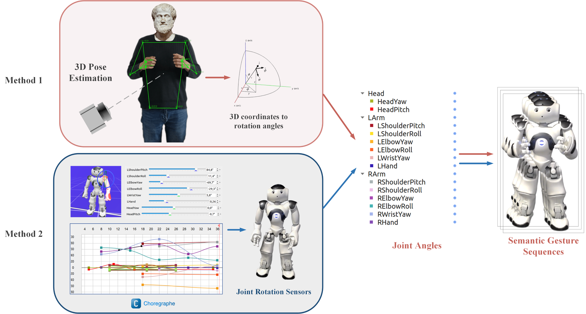

HUGS (Humorous Gesture Dataset with Semantic) is a semantic gesture dataset that contains 261 clear and easily recognizable semantic gestures.
All these gestures were created through the following two methods.
1. The first method involves recording a volunteer performing gestures with an RGB camera. We used BlazePose to extract 3D joint coordinates and compute joint angles, generating 67 gestures with relatively natural motion. However, due to BlazePose’s limited depth accuracy, especially in joint estimation, we had to manually refine the angle data—resulting in a significant workload. 
2. In the second method, we used Choregraphe, a graphical programming tool, to design the remaining semantic gestures. It allows gesture creation by setting key frames, with automatic interpolation of intermediate frames. Designers can either input joint angles directly or pose the virtual robot via an interactive interface. The finalized gestures are then mapped to the real robot, and joint angles are recorded at 30 fps using robot built-in sensors. This method produces precise, easily modifiable semantic gestures that closely match the intended designs.

